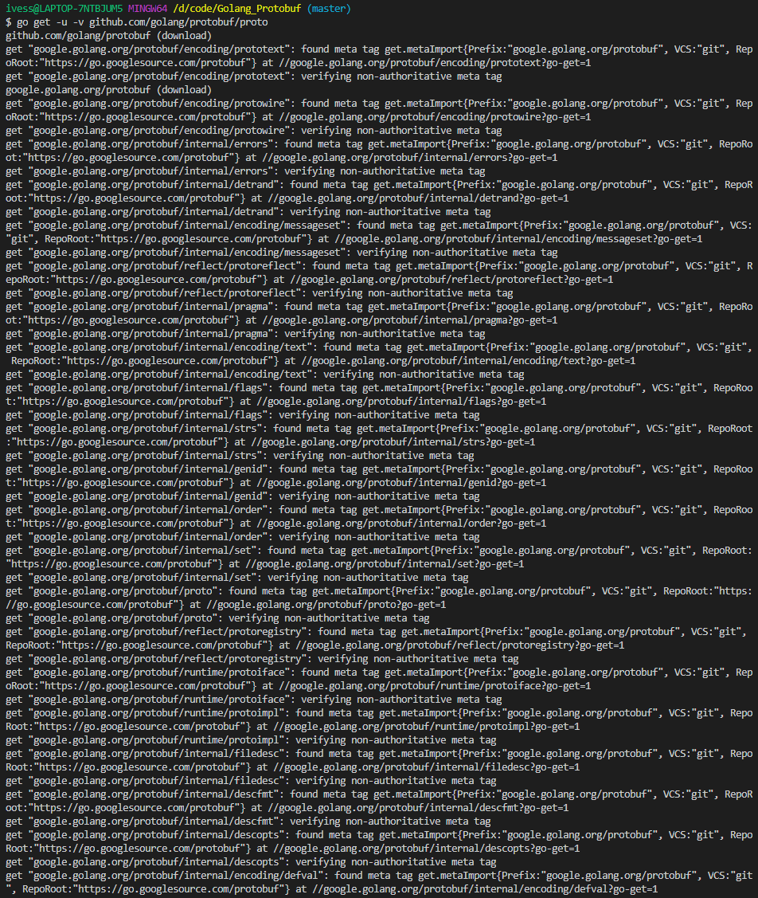
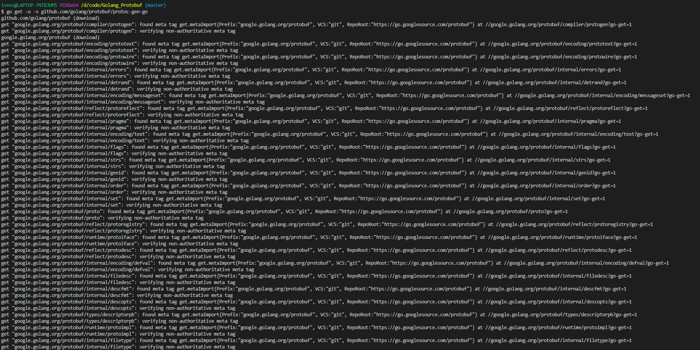
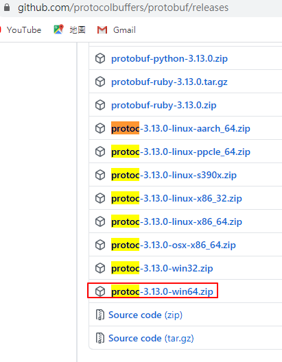
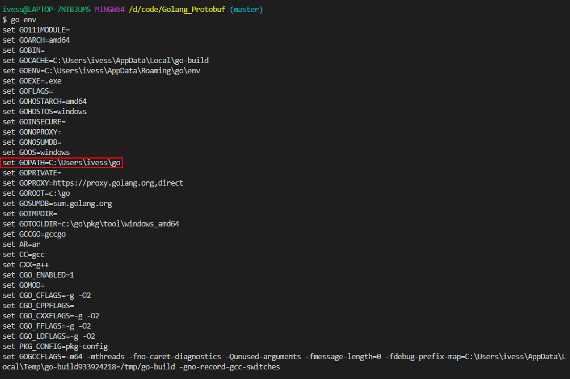
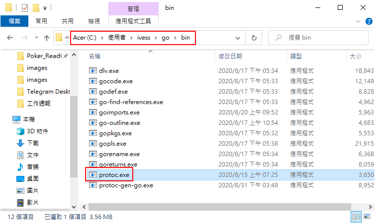
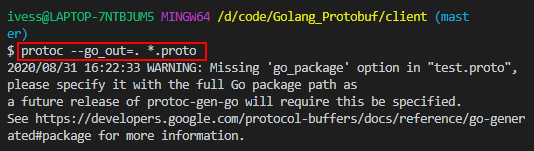
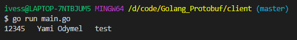

# Golang_Protobuf

下載並安裝
```shell
go get -u -v github.com/golang/protobuf/proto
```



```shell
go get -u -v github.com/golang/protobuf/protoc-gen-go
```




# 下載proto編譯工具



查看path的目錄

```shell
go env
```





查看protoc版本

```shell
protoc --version
```

將proto轉化成Golang程式

```shell
protoc --go_out=. *.proto
```




#!/bin/bash

https://lihaoquan.me/2017/6/29/how-to-use-protobuf.html




# example/example.proto

```c
// 撰寫格式是 Proto v3。
syntax = "proto3";  
// 生成的程式在 Golang 中將會屬於 `protobuf` 套件。
package example;

// User 帶有使用者資料，如帳號、密碼。
message User {  
    int64  id       = 1;
    string username = 2;
    string password = 3;
}
```

# main.go

```go
package main

import (
	"fmt"

	"./example"
	"github.com/golang/protobuf/proto"
)

func main() {
	// 建立一個 User 格式，並在其中放入資料。
	data := example.User{
		Id:       12345,
		Username: "Yami Odymel",
		Password: "test",
	}

	// 將資料編碼成 Protocol Buffer 格式（請注意是傳入 Pointer）。
	dataBuffer, _ := proto.Marshal(&data)

	// 將已經編碼的資料解碼成 protobuf.User 格式。 
	var user example.User
	proto.Unmarshal(dataBuffer, &user)

	// 輸出解碼結果。
	fmt.Println(user.Id, " ", user.Username, " ", user.Password)
}
```

# 執行結果

```shell
go run main.go
```

# 小結

程式很簡單，儘管有上一次nodejs使用過protobuf的經驗，但這次其實還是花了不少時間找資料跟測試踩雷，先試成功一個proto2的版本，又找到一個proto3的版本，但找到的資料照著作run不起來，又花了一些時間檢查及測試，才run起來，但只是很簡單的編碼、解碼而已，實際work使用到的深度，遠超過此，單純小練一下